# AI Shopping Concierge - System Architecture

This document outlines the complete architecture of our AI Shopping Concierge application running on Google Kubernetes Engine (GKE). The system combines semantic search, AI-powered conversations, and e-commerce functionality to deliver an intelligent shopping experience.

## High-Level Architecture Overview

```mermaid
graph TB
    User[👤 User] --> LB[🌐 Google Cloud Load Balancer]
    
    subgraph "Google Cloud Platform"
        subgraph "Google Kubernetes Engine (GKE) Cluster"
            subgraph "Frontend Layer"
                LB --> UI[🖥️ Streamlit UI<br/>Port: 80/8501]
            end
            
            subgraph "AI Processing Layer"  
                UI --> ADK[🤖 ADK Agents<br/>Semantic Search & AI<br/>Port: 8000]
            end
            
            subgraph "Data Access Layer"
                ADK --> MCP[📡 MCP Server<br/>Product Data API<br/>Port: 8080]
            end
            
            subgraph "E-commerce Backend"
                MCP --> OB[🛒 Online Boutique<br/>Microservices Demo<br/>Multiple Services]
            end
        end
        
        subgraph "Google Cloud Services"
            AR[📦 Artifact Registry<br/>Container Images]
            IAM[🔐 IAM & Service Accounts]
            VPC[🌐 VPC Network]
        end
    end
    
    subgraph "External AI Services"
        GEMINI[🧠 Google Gemini API<br/>Conversational AI]
    end
    
    ADK -.-> GEMINI
    GKE --> AR
    GKE --> IAM  
    GKE --> VPC
    
    classDef frontend fill:#e1f5fe
    classDef ai fill:#f3e5f5
    classDef data fill:#e8f5e8
    classDef backend fill:#fff3e0
    classDef cloud fill:#f5f5f5
    classDef external fill:#ffebee
    
    class UI frontend
    class ADK ai
    class MCP data
    class OB backend
    class AR,IAM,VPC cloud
    class GEMINI external
```



## Detailed Component Architecture

### 1. Frontend Layer - Streamlit UI

```mermaid
graph LR
    subgraph "Streamlit UI Container"
        WebUI[🖥️ Web Interface<br/>Streamlit App]
        ChatUI[💬 Chat Interface]
        SearchUI[🔍 Product Search]
        CartUI[🛒 Shopping Cart]
    end
    
    subgraph "API Connections"  
        ADK_API[ADK Agents API<br/>http://adk-agents-service:8000]
        MCP_API[MCP Server API<br/>http://mcp-server-service:8080]
    end
    
    WebUI --> ChatUI
    WebUI --> SearchUI  
    WebUI --> CartUI
    
    ChatUI --> ADK_API
    SearchUI --> ADK_API
    CartUI --> MCP_API
    
    classDef ui fill:#e1f5fe
    classDef api fill:#f0f4c3
    
    class WebUI,ChatUI,SearchUI,CartUI ui
    class ADK_API,MCP_API api
```



**Key Features:**
- Interactive chat interface for natural language shopping assistance
- Real-time product search with semantic understanding
- Shopping cart management with session persistence
- Responsive web design optimized for various devices

**Technology Stack:**
- **Framework:** Streamlit (Python web framework)
- **HTTP Client:** HTTPX for async API calls
- **Session Management:** Streamlit session state
- **Deployment:** Docker container on Kubernetes

### 2. AI Processing Layer - ADK Agents

```mermaid
graph TB
    subgraph "ADK Agents Service"
        FastAPI[⚡ FastAPI Server<br/>Port: 8000]
        
        subgraph "AI Components"
            NLP[📝 Natural Language<br/>Processing]
            SemSearch[🔍 Semantic Search<br/>Engine]
            ML[🧠 Machine Learning<br/>Models]
        end
        
        subgraph "ML Libraries (Optional)"
            ST[🔤 SentenceTransformers<br/>Text Embeddings]
            SKL[📊 Scikit-learn<br/>Similarity Metrics]  
            SP[🌿 spaCy<br/>NLP Pipeline]
        end
        
        subgraph "External APIs"
            GeminiAPI[🧠 Google Gemini<br/>Conversational AI]
            MCPAPI[📡 MCP Server<br/>Product Data]
        end
    end
    
    FastAPI --> NLP
    FastAPI --> SemSearch
    FastAPI --> ML
    
    NLP --> ST
    SemSearch --> ST
    SemSearch --> SKL
    NLP --> SP
    
    FastAPI --> GeminiAPI
    FastAPI --> MCPAPI
    
    classDef server fill:#f3e5f5
    classDef ai fill:#e8f5e8  
    classDef ml fill:#fff3e0
    classDef external fill:#ffebee
    
    class FastAPI server
    class NLP,SemSearch,ML ai
    class ST,SKL,SP ml
    class GeminiAPI,MCPAPI external
```



**Key Features:**
- **Semantic Search:** Understands user intent beyond keyword matching
- **AI Conversations:** Powered by Google Gemini for natural interactions
- **Product Recommendations:** ML-based similarity scoring and recommendations
- **Graceful Degradation:** Falls back to keyword search when ML libraries unavailable

**Technology Stack:**
- **Framework:** FastAPI (Python async web framework)
- **AI Service:** Google Gemini API for conversational intelligence
- **ML Libraries:** SentenceTransformers, scikit-learn, spaCy (optional)
- **Embeddings:** Sentence transformers for semantic similarity
- **Deployment:** Docker container with optional ML dependencies

### 3. Data Access Layer - MCP Server

```mermaid
graph TB
    subgraph "MCP Server"
        FastAPI2[⚡ FastAPI Server<br/>Port: 8080]
        
        subgraph "API Endpoints"
            ProductAPI[🏷️ Product Catalog<br/>API]
            CartAPI[🛒 Shopping Cart<br/>API]
            SearchAPI[🔍 Product Search<br/>API]
        end
        
        subgraph "gRPC Clients"
            ProdClient[📦 Product Catalog<br/>gRPC Client]
            CartClient[🛒 Cart Service<br/>gRPC Client]
        end
        
        subgraph "Error Handling"
            ErrorHandler[⚠️ Error Translation<br/>& User Messages]
        end
    end
    
    subgraph "Online Boutique Services"
        ProdSvc[🏪 Product Catalog Service<br/>:3550]
        CartSvc[🛒 Cart Service<br/>:7070]
    end
    
    FastAPI2 --> ProductAPI
    FastAPI2 --> CartAPI
    FastAPI2 --> SearchAPI
    
    ProductAPI --> ProdClient
    CartAPI --> CartClient
    SearchAPI --> ProdClient
    
    ProdClient --> ProdSvc
    CartClient --> CartSvc
    
    ProductAPI --> ErrorHandler
    CartAPI --> ErrorHandler
    SearchAPI --> ErrorHandler
    
    classDef server fill:#e8f5e8
    classDef api fill:#f0f4c3
    classDef grpc fill:#e1f5fe
    classDef error fill:#ffcdd2
    classDef external fill:#f5f5f5
    
    class FastAPI2 server
    class ProductAPI,CartAPI,SearchAPI api
    class ProdClient,CartClient grpc
    class ErrorHandler error
    class ProdSvc,CartSvc external
```



**Key Features:**
- **Protocol Translation:** Converts REST API calls to gRPC for backend services
- **Error Handling:** Translates technical errors into user-friendly messages
- **Data Transformation:** Formats product and cart data for frontend consumption
- **Service Discovery:** Uses Kubernetes DNS for service communication

**Technology Stack:**
- **Framework:** FastAPI with Pydantic models
- **Communication:** gRPC for backend communication, REST for frontend
- **Protocol Buffers:** For structured data exchange with microservices
- **Error Handling:** Custom error translation and user messaging

### 4. E-commerce Backend - Online Boutique

```mermaid
graph TB
    subgraph "Online Boutique Microservices"
        subgraph "Frontend Services"
            Frontend[🌐 Frontend Service<br/>Web UI]
        end
        
        subgraph "Core Services"
            ProductCatalog[🏷️ Product Catalog<br/>Service :3550]
            CartService[🛒 Cart Service<br/>:7070] 
            RecommendationService[💡 Recommendation<br/>Service]
            CheckoutService[💳 Checkout<br/>Service]
        end
        
        subgraph "Supporting Services"
            CurrencyService[💱 Currency<br/>Service]
            PaymentService[💰 Payment<br/>Service]
            EmailService[📧 Email<br/>Service]
            ShippingService[📦 Shipping<br/>Service]
            AdService[📢 Ad Service]
        end
        
        subgraph "Infrastructure"
            Redis[🔴 Redis<br/>Session Storage]
            LoadGenerator[⚡ Load Generator<br/>Traffic Simulation]
        end
    end
    
    Frontend --> ProductCatalog
    Frontend --> CartService
    Frontend --> RecommendationService
    Frontend --> CheckoutService
    
    CheckoutService --> PaymentService
    CheckoutService --> ShippingService
    CheckoutService --> EmailService
    CheckoutService --> CurrencyService
    
    CartService --> Redis
    RecommendationService --> ProductCatalog
    
    classDef frontend fill:#e1f5fe
    classDef core fill:#e8f5e8
    classDef support fill:#fff3e0
    classDef infra fill:#f5f5f5
    
    class Frontend frontend
    class ProductCatalog,CartService,RecommendationService,CheckoutService core
    class CurrencyService,PaymentService,EmailService,ShippingService,AdService support  
    class Redis,LoadGenerator infra
```

**Key Features:**
- **Microservices Architecture:** Loosely coupled services with specific responsibilities
- **Service Mesh Ready:** Compatible with Istio for advanced traffic management
- **Polyglot Implementation:** Services written in different programming languages
- **Production Ready:** Includes monitoring, logging, and performance testing

## Infrastructure & Deployment Architecture

### Kubernetes Deployment Structure

```mermaid
graph TB
    subgraph "Google Kubernetes Engine (GKE)"
        subgraph "default namespace"
            subgraph "Custom Applications"
                StreamlitPod[🖥️ Streamlit UI Pod<br/>streamlit-ui-service<br/>LoadBalancer: External IP]
                ADKPod[🤖 ADK Agents Pod<br/>adk-agents-service<br/>ClusterIP: Internal]
                MCPPod[📡 MCP Server Pod<br/>mcp-server-service<br/>ClusterIP: Internal]
            end
            
            subgraph "Online Boutique Services"
                FrontendPod[🌐 Frontend Pod<br/>frontend-external<br/>LoadBalancer: External IP]
                ProductPod[🏷️ Product Catalog Pod<br/>productcatalogservice<br/>ClusterIP: Internal]
                CartPod[🛒 Cart Service Pod<br/>cartservice<br/>ClusterIP: Internal]
                CheckoutPod[💳 Checkout Pod<br/>checkoutservice<br/>ClusterIP: Internal]
                OtherPods[⚙️ Other Microservice Pods<br/>Various ClusterIP Services]
                RedisPod[🔴 Redis Pod<br/>redis-cart<br/>ClusterIP: Internal]
            end
        end
        
        subgraph "Secrets & ConfigMaps"
            GeminiSecret[🔐 Gemini API Key<br/>Secret]
            ConfigMaps[⚙️ Application<br/>ConfigMaps]
        end
        
        subgraph "Persistent Storage"
            PVC[💾 Persistent Volume<br/>Claims]
        end
    end
    
    subgraph "Google Cloud Infrastructure"
        LB[🌐 Load Balancer<br/>External Traffic]
        Nodes[🖥️ GKE Nodes<br/>e2-standard-2<br/>8GB RAM each]
        AR[📦 Artifact Registry<br/>Container Storage]
    end
    
    LB --> StreamlitPod
    LB --> FrontendPod
    StreamlitPod --> ADKPod
    ADKPod --> MCPPod  
    MCPPod --> ProductPod
    MCPPod --> CartPod
    
    ADKPod --> GeminiSecret
    
    classDef custom fill:#e1f5fe
    classDef boutique fill:#e8f5e8
    classDef config fill:#fff3e0
    classDef infra fill:#f5f5f5
    classDef storage fill:#fce4ec
    
    class StreamlitPod,ADKPod,MCPPod custom
    class FrontendPod,ProductPod,CartPod,CheckoutPod,OtherPods,RedisPod boutique
    class GeminiSecret,ConfigMaps config
    class LB,Nodes,AR infra
    class PVC storage
```



### Terraform Infrastructure Components

```mermaid
graph LR
    subgraph "Terraform Configuration"
        subgraph "Core Infrastructure"
            GKE[☸️ GKE Cluster<br/>e2-standard-2 nodes<br/>Auto-scaling enabled]
            VPC[🌐 VPC Network<br/>Custom subnet<br/>Firewall rules]
            AR[📦 Artifact Registry<br/>Docker repository]
        end
        
        subgraph "Security & Access"
            SA[🔐 Service Accounts<br/>IAM permissions<br/>Workload Identity]
            Secrets[🔑 Secret Manager<br/>API keys & credentials]
        end
        
        subgraph "Monitoring & Ops"
            Monitoring[📊 Cloud Monitoring<br/>Metrics & alerts]
            Logging[📝 Cloud Logging<br/>Centralized logs]
        end
    end
    
    subgraph "Cost Management"
        AutoScale[📈 Node Auto-scaling<br/>Scale to zero capability]
        Preemptible[💰 Preemptible Nodes<br/>Cost optimization]
        PauseResume[⏸️ Pause/Resume<br/>Cluster scaling]
    end
    
    GKE --> SA
    GKE --> VPC
    GKE --> AR
    SA --> Secrets
    GKE --> Monitoring
    GKE --> Logging
    GKE --> AutoScale
    AutoScale --> Preemptible
    AutoScale --> PauseResume
    
    classDef infra fill:#e8f5e8
    classDef security fill:#ffcdd2
    classDef ops fill:#e1f5fe
    classDef cost fill:#fff3e0
    
    class GKE,VPC,AR infra
    class SA,Secrets security
    class Monitoring,Logging ops
    class AutoScale,Preemptible,PauseResume cost
```



## Data Flow & Communication Patterns

### User Interaction Flow

```mermaid
sequenceDiagram
    participant User
    participant Streamlit as 🖥️ Streamlit UI
    participant ADK as 🤖 ADK Agents  
    participant Gemini as 🧠 Gemini API
    participant MCP as 📡 MCP Server
    participant OB as 🛒 Online Boutique
    
    User->>Streamlit: "I need running shoes"
    Streamlit->>ADK: POST /chat {"message": "I need running shoes"}
    
    ADK->>ADK: Semantic analysis & intent extraction
    ADK->>MCP: GET /list_products
    MCP->>OB: gRPC GetProducts()
    OB-->>MCP: Product catalog data
    MCP-->>ADK: JSON product list
    
    ADK->>ADK: ML-based semantic matching
    ADK->>Gemini: Generate conversational response
    Gemini-->>ADK: AI-generated response
    
    ADK-->>Streamlit: {"response": "Here are some great running shoes...", "products": [...]}
    Streamlit-->>User: Display chat response + product cards
    
    User->>Streamlit: Click "Add to Cart" 
    Streamlit->>MCP: POST /add_to_cart {"user_id": "...", "product_id": "..."}
    MCP->>OB: gRPC AddItem()
    OB-->>MCP: Cart updated confirmation
    MCP-->>Streamlit: Success response
    Streamlit-->>User: Cart updated notification
```



### Service Communication Patterns

```mermaid
graph TB
    subgraph "Communication Protocols"
        subgraph "External (Internet)"
            UserHTTPS[👤 User ⟷ Browser<br/>HTTPS/WebSocket]
            GeminiHTTPS[🤖 ADK ⟷ Gemini API<br/>HTTPS/REST]
        end
        
        subgraph "Inter-Service (Kubernetes)"
            StreamlitHTTP[🖥️ Streamlit ⟷ ADK<br/>HTTP/REST<br/>Kubernetes DNS]
            ADKHTTP[🤖 ADK ⟷ MCP<br/>HTTP/REST<br/>Kubernetes DNS] 
            MCPgRPC[📡 MCP ⟷ Online Boutique<br/>gRPC<br/>Kubernetes DNS]
        end
        
        subgraph "Internal (Microservices)"
            OBgRPC[🛒 Online Boutique<br/>Inter-service gRPC<br/>Service Mesh Ready]
        end
    end
    
    subgraph "Service Discovery"
        K8sDNS[☸️ Kubernetes DNS<br/>service.namespace.svc.cluster.local]
        ServiceMesh[🕸️ Istio Service Mesh<br/>(Optional)]
    end
    
    StreamlitHTTP --> K8sDNS
    ADKHTTP --> K8sDNS
    MCPgRPC --> K8sDNS
    OBgRPC --> ServiceMesh
    
    classDef external fill:#ffebee
    classDef inter fill:#e8f5e8
    classDef internal fill:#e1f5fe
    classDef discovery fill:#fff3e0
    
    class UserHTTPS,GeminiHTTPS external
    class StreamlitHTTP,ADKHTTP,MCPgRPC inter
    class OBgRPC internal
    class K8sDNS,ServiceMesh discovery
```

## Security Architecture

```mermaid
graph TB
    subgraph "Security Layers"
        subgraph "Network Security"
            VPCSec[🌐 VPC Network<br/>Private subnets<br/>Firewall rules]
            LBSec[🛡️ Load Balancer<br/>HTTPS termination<br/>DDoS protection]
        end
        
        subgraph "Kubernetes Security"
            RBAC[👥 RBAC<br/>Role-based access<br/>Service accounts]
            NetPol[🚧 Network Policies<br/>Pod-to-pod restrictions]
            SecCtx[🔒 Security Context<br/>Non-root containers<br/>Read-only filesystems]
        end
        
        subgraph "Application Security"
            SecretMgmt[🔑 Secret Management<br/>K8s secrets<br/>Google Secret Manager]
            APIAuth[🔐 API Authentication<br/>Service-to-service<br/>API key validation]
        end
        
        subgraph "Container Security"
            ImageScan[🔍 Container Scanning<br/>Vulnerability detection<br/>Artifact Registry]
            MinimalBase[📦 Minimal Base Images<br/>Distroless containers<br/>Reduced attack surface]
        end
    end
    
    VPCSec --> LBSec
    LBSec --> RBAC
    RBAC --> NetPol
    NetPol --> SecCtx
    
    SecCtx --> SecretMgmt
    SecretMgmt --> APIAuth
    
    SecCtx --> ImageScan
    ImageScan --> MinimalBase
    
    classDef network fill:#e1f5fe
    classDef k8s fill:#e8f5e8
    classDef app fill:#fff3e0
    classDef container fill:#fce4ec
    
    class VPCSec,LBSec network
    class RBAC,NetPol,SecCtx k8s
    class SecretMgmt,APIAuth app
    class ImageScan,MinimalBase container
```



## Monitoring & Observability

```mermaid
graph TB
    subgraph "Observability Stack"
        subgraph "Metrics Collection"
            Prometheus[📊 Prometheus<br/>(Optional)]
            GCM[📈 Google Cloud Monitoring<br/>Built-in metrics]
            CustomMetrics[📋 Custom Application<br/>Metrics]
        end
        
        subgraph "Logging"
            GCL[📝 Google Cloud Logging<br/>Centralized logs]
            StructuredLogs[📄 Structured Logging<br/>JSON format]
            LogAggr[📚 Log Aggregation<br/>Multi-service correlation]
        end
        
        subgraph "Tracing" 
            CloudTrace[🔍 Google Cloud Trace<br/>(Optional)]
            Jaeger[🕸️ Jaeger<br/>(Optional)]
        end
        
        subgraph "Alerting"
            Alerts[🚨 Cloud Monitoring<br/>Alerts]
            PagerDuty[📞 PagerDuty<br/>(Optional)]
            Slack[💬 Slack Notifications<br/>(Optional)]
        end
        
        subgraph "Dashboards"
            GCDash[📊 Google Cloud<br/>Dashboards]
            Grafana[📈 Grafana<br/>(Optional)]
            K8sDash[☸️ Kubernetes<br/>Dashboard]
        end
    end
    
    GCM --> CustomMetrics
    Prometheus --> GCM
    
    GCL --> StructuredLogs
    StructuredLogs --> LogAggr
    
    CloudTrace --> Jaeger
    
    GCM --> Alerts
    Alerts --> PagerDuty
    Alerts --> Slack
    
    GCM --> GCDash
    Prometheus --> Grafana
    GCM --> K8sDash
    
    classDef metrics fill:#e8f5e8
    classDef logging fill:#e1f5fe
    classDef tracing fill:#fff3e0
    classDef alerting fill:#ffcdd2
    classDef dashboard fill:#f3e5f5
    
    class Prometheus,GCM,CustomMetrics metrics
    class GCL,StructuredLogs,LogAggr logging
    class CloudTrace,Jaeger tracing
    class Alerts,PagerDuty,Slack alerting
    class GCDash,Grafana,K8sDash dashboard
```

## Technology Stack Summary

| Layer | Technology | Purpose | Key Features |
|-------|------------|---------|--------------|
| **Frontend** | Streamlit (Python) | Web Interface | Interactive chat, product search, cart management |
| **AI Processing** | FastAPI + ML Libraries | Semantic Search & AI | NLP, embeddings, similarity matching |
| **Data Access** | FastAPI + gRPC | Protocol Translation | REST ↔ gRPC conversion, error handling |
| **Backend** | Online Boutique | E-commerce Services | Microservices, polyglot architecture |
| **Infrastructure** | GKE + Terraform | Container Orchestration | Auto-scaling, cost management |
| **AI Services** | Google Gemini | Conversational AI | Natural language understanding |
| **Storage** | Redis, Persistent Volumes | Data Persistence | Cart data, application state |
| **Monitoring** | Google Cloud Ops | Observability | Metrics, logs, alerts, dashboards |

## Deployment & Operations

### Cost Optimization Features

- **Pause/Resume Functionality**: Scale cluster to zero nodes when not in use ($40/month → $3/month)
- **Node Auto-scaling**: Automatically adjust cluster size based on workload
- **Preemptible Nodes**: Use cost-effective preemptible instances where possible
- **Resource Limits**: Prevent runaway resource consumption

### Development Workflow

1. **Infrastructure Setup**: Terraform provisions GKE cluster and dependencies
2. **Application Build**: Docker images built and pushed to Artifact Registry  
3. **Deployment**: Kubernetes manifests deploy applications to cluster
4. **Testing**: Automated health checks and integration tests
5. **Monitoring**: Continuous monitoring of metrics and logs
6. **Cost Management**: Pause cluster when not actively developing

This architecture provides a scalable, cost-effective foundation for an AI-powered shopping experience that can handle production workloads while maintaining development flexibility.